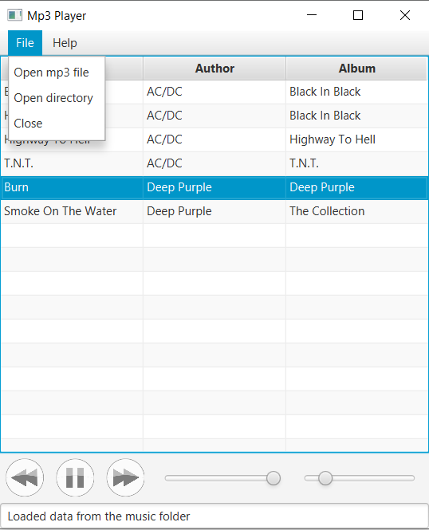

# MP3 PLayer #
A simple mp3 player that lets you volume controls, pause song, scrolling a song and skip to the next song. 
Project created to learn new technologies

##  Screenshots ##

## Technologies ##
Project is created with:
- JavaFX 11.01
- CSS 5
- Java ID3 Tag Library 0.5.4

## Installation ##
1. Press the Fork button (top right the page) to save copy of this project on your account.
2. Download the repository files (project) from the download section or clone this project by typing in the bash the following command:
`git clone https://github.com/HouariZegai/Calculator.git`
3. Imported it in Intellij IDEA or any other Java IDE.
4. Run the application 
